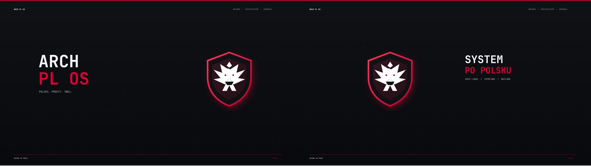

# ARCH PL OS

**Polski. Prosty. Twój.**

ARCH PL OS to kompletne, odtwarzalne środowisko pulpitu dla Arch Linux i Hyprland, przygotowane od początku dla polskich użytkowników.



## Co otrzymujesz

- polski panel systemowy Waybar;
- polski launcher Wofi;
- polskie powiadomienia i komunikaty;
- polski ekran blokady;
- animowane powitanie i wielomonitorowy wygaszacz;
- spójny motyw karmazyn / biel / grafit;
- tapety 4K automatycznie dopasowane do układu monitorów;
- Alacritty, Dunst, Hypridle i Awww;
- automatyczną konfigurację `pl_PL.UTF-8`;
- backup przed każdą instalacją;
- jedno polecenie do aktualizacji i jedno do przywrócenia zmian.

Projekt nie zawiera haseł, tokenów, kluczy SSH ani danych użytkownika.

## Wymagania

- Arch Linux x86_64;
- działająca sesja Hyprland / Wayland;
- połączenie z internetem;
- konto użytkownika z dostępem do `sudo`.

## Instalacja

```bash
git clone https://github.com/zi3lak/arch-pl-os.git
cd arch-pl-os
./instaluj.sh --proba
./instaluj.sh
```

Po instalacji wyloguj się i zaloguj ponownie, aby wszystkie ustawienia języka zostały zastosowane.

Pełna instrukcja: [docs/instalacja.html](docs/instalacja.html)

## Diagnostyka

```bash
./sprawdz.sh
```

## Aktualizacja

```bash
./aktualizuj.sh
```

## Powrót do poprzedniego pulpitu

```bash
./przywroc.sh
```

Kopie znajdują się w `~/.local/state/arch-pl-os/kopie/`.

## Skróty

| Skrót | Działanie |
|---|---|
| `Super + Spacja` | wyszukiwarka programów |
| `Super + Q` | terminal |
| `Super + L` | blokada komputera |
| `Super + Shift + W` | zmiana trybu tapety |
| `Print Screen` | zrzut całego ekranu |
| `Super + Print Screen` | zrzut wybranego obszaru |

## Strona projektu

Po publikacji GitHub Pages: `https://zi3lak.github.io/arch-pl-os/`

## Struktura repozytorium

```text
assets/          logo i materiały pulpitu 4K
apps/            animacja powitalna i wygaszacz
bin/             skrypty uruchomieniowe i telemetria
config/          konfiguracje pulpitu
docs/            minimalistyczna strona i poradniki
instaluj.sh      bezpieczny instalator
przywroc.sh      pełny rollback
aktualizuj.sh    aktualizacja projektu
sprawdz.sh       diagnostyka działającej instalacji
sprawdz-repo.sh  test integralności repozytorium
```

## Zasady projektu

1. Cały interfejs użytkownika jest po polsku.
2. Instalator najpierw tworzy kopię.
3. Konfiguracja jest czytelna i możliwa do samodzielnej zmiany.
4. Projekt nie zapisuje sekretów ani danych osobistych.
5. Minimalizm ma poprawiać obsługę, a nie tylko wygląd.

## Licencja

GNU GPL v3. Zobacz plik [LICENSE](LICENSE).
